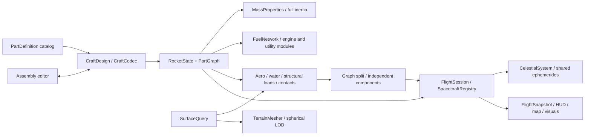

# Godot Space Program — Phases 1–6 implementation report

Implementation date: 2026-10-01. The six phases are implemented, with the acceptance evidence and limits below. All 20 assertion suites/variants have passing runs after targeted corrections; native exits and error logs were checked. Final regression/performance results are in [VALIDATION.md](VALIDATION.md). The large-craft atmospheric performance budget remains unmet.

Updated Linux x86-64 ZIP/tar.gz packages are available in `build/linux-x86_64/`. The final tarball passes headless menu/launchpad/orbit startup under Ubuntu/WSL with clean logs. [Build instructions and checksums](LINUX_BUILD.md). Graphics on Linux remain untested.

## Architecture

The authoritative spacecraft is a connected tree of `PartInstance` objects, with composed module state and tank-owned resources. One `RocketState : FlightBody` integrates each connected component; the visual nodes never own flight physics. `CraftDesign` is the shared editor/serialization/flight recipe. `CraftCodec` validates it before loading; `CraftBuilder` implements construction operations. The original stage-based runtime remains only as a test fixture.

Absolute position/velocity are scalar doubles in the original Aster inertial frame. Local attitude uses quaternions, with double local vector/tensor calculations. Dynamic fuel removal updates COM and inertia while preserving the remaining parts' world poses and rigid velocity field. Mass-weighted separation and socket impulses preserve linear/angular momentum. Gravity, thrust, drag, buoyancy and torque share the same fixed-step dynamics.

Neris integration is adapted temporarily to its translating, nonrotating frame. Both fixed-step integration and analytic coast add the same ephemeris at the new epoch. SOI selection itself only changes a reference tag. The map predicts timed coast segments using the same conics, ephemerides and crossing policy.

## Phase summary

| Phase | Delivered | Acceptance evidence |
| --- | --- | --- |
| 1 | Real six-part OTV, modules, resources, routing, full mass/COM/inertia, nozzle wrenches, staging/splitting, session/registry/snapshot, codec | Fixed 29 t wet/6 t dry/26 m invariants; conservation and COM tests; both migrated orbital ascent variants |
| 2 | Per-part aero/pressure centres/shielding, axial/shear/bending/torsion loads, deterministic failure, part contacts/damage, persistent nearby wrecks, inspector/stress overlay, original sound/FX | Free fall and rated-load tests; spinning split conservation; gentle/destructive contacts; live powered debris after structural breakup |
| 3 | 21-part catalog, 3D placement/snapping/branches, 1/2/3/4/6/8 symmetry, settings, stage action drag/drop/reordering, engineering markers/statistics, save/load/new/launch, undo/redo | Empty editor → two-stage craft → save → reload → physical orbit, plus all symmetry counts and branch/history checks |
| 4 | Shared spherical terrain/collision, nested LOD, mountains/coasts/plateau, global/local ocean, waves, volume buoyancy, drag/damping, destructive water impacts, splash/foam/spray/wakes/ripples, underwater fog | Shared vertex/query error <0.01 m; capsule flotation/displacement equilibrium; dense debris sinking; destructive 100 m/s impact; rendered water checks |
| 5 | Shared Sun, altitude/local-horizon sky, twilight, limb glow, two advecting cloud shells, approximate cloud shadows, night-side land-only city lights, ocean polish | Actual rendered orbital/day/night/twilight captures; simulation-time cloud advection; unchanged atmospheric density |
| 6 | Neris definitions/ephemerides/shared clock, patched-conic forces/warp/prediction, continuous SOI transitions, encounter/Pe markers, Moon terrain/collision, Explorer craft | Full physical Aster launch → lunar capture → one orbit → escape → Aster atmospheric return; separate powered lunar landing |

## Tests and physics results

- Phase 1 migrated envelope-aero ascent: 301.71 s, 161.974 × 65.051 km; manual-input variant 301.52 s, 162.130 × 65.028 km. These meet the original migration envelope; no engine/gravity retuning was used.
- Production per-part aero and raised-terrain ascent: 308.55 s, 158.146 × 65.025 km; 74.6% upper propellant, 22.229 kPa peak dynamic pressure. A complete engine-off orbit passes the original 5 m drift limit; reported drift was below 1e-6 m.
- The rendered editor test independently builds/saves/reloads/launches to orbit. Screenshots of initialized orbit fixtures are never used as proof of ascent.
- Split tests check both linear and angular momentum to 1e-8 relative and part world positions within 1e-5 m. Uniform free fall generates no fictitious structural load.
- Water equilibrium: submerged fraction 0.1076 versus displaced-volume prediction 0.1102 (0.02 acceptance tolerance); settled speed below 0.3 m/s. Dense engines sink; hard water entry destroys the capsule without numerical blow-up.
- Lunar force/coast propagation agrees within 5 cm/1 mm/s over 30 seconds. One lunar coast orbit retains periapsis within 1 cm. Reference selection leaves inertial position and velocity exactly unchanged. The whole-interval guard rejects an enter-and-exit SOI flyby.
- Full lunar mission: initial Aster orbit at 308.55 s; TLI at 1843.42 s; SOI entry at 5413.42 s; finite-thrust approach correction to 25.006 km lunar Pe; capture into 109.899 × 22.677 km at 5915.13 s; one unpowered lunar orbit; escape at 12349.63 s; Aster atmosphere at 15129.63 s with 33.3% upper propellant.
- Separate Neris Explorer landing fixture: seeded 120 m above terrain with 3 m/s descent, ordinary thrust/SAS control, all eight upper parts survive and settle; 46.67 s, 98.6% propellant remaining. This is not claimed as an end-to-end launch/landing/return mission.

Detailed logs, regression status and final performance measurements are recorded in [VALIDATION.md](VALIDATION.md). The test runner rejects native process failures as well as Godot errors; passing assertions alone do not count as a clean run. Final manual-input ascent reached 158.847 × 65.088 km at 307.77 s and completed its unpowered orbit. The rendered editor acceptance was rerun successfully at 308.55 s after the later integrations.

| Parts | Full vacuum substep | Full atmospheric substep |
| ---: | ---: | ---: |
| 10 | 0.414 ms | 2.665 ms |
| 50 | 1.244 ms | 18.300 ms |
| 100 | 2.290 ms | 19.949 ms |
| 300 | 3.524 ms | 71.628 ms |

Measured on the i7-1255U development machine using Godot's debug editor executable. Two substeps make one normal 60 Hz tick; rendering/debris are additional. These finite large-craft stress runs do **not** meet the proposed 100-part atmospheric frame budget. See the validation record for fixture conditions, variability and cached mass timings.

## Editor, structure, terrain and visual status

The builder and flight consume the same catalog/design/graph. Fuel-fill/thrust-limit and utility settings are saved; stages operate on actual modules and connector cuts. The three prebuilt designs are OTV, Basic Suborbital Rocket and Neris Explorer. The editor pressure marker is a directional engineering estimate, not a universal constant centre of pressure.

Connection failures come from measured loads, with no random failure. Parts retain their own resource/engine state across cuts. Contacts use cylindrical support proxies and effective-mass impulses. Near wreckage persists; beyond 200 km the current lifecycle culls debris. F4 and the part inspector make loads/damage visible.

Near terrain is a curved clipmap over the same query used by contact physics; far terrain uses a coarser global mesh. Water forces depend on clipped part volume and the relative moving wave field, not a sea-level position clamp. Surface FX track wet parts. Sky/cloud/light effects do not change physical atmospheric constants.

All terrain, craters, clouds, city lights, meshes and sounds are original procedural content. Neris is rendered in the sky and from orbit; its surface is airless. The Sun emitter stays white; twilight colour belongs to atmospheric scattering/cloud illumination.

## Captures

- [Assembly workspace](validation/18_vehicle_assembly.png), [editor-built craft in orbit](validation/19_editor_craft_orbit.png)
- [Structural breakup](validation/17_structural_breakup.png), [terrain launchpad](validation/20_terrain_launchpad.png)
- [Floating capsule](validation/21_capsule_splashdown.png), [underwater camera](validation/22_underwater.png)
- [Aster/clouds from orbit](validation/23_aster_clouds_orbit.png), [night lights](validation/24_aster_night_lights.png), [twilight](validation/25_twilight_horizon.png)
- [Neris flight view](validation/26_neris_orbit_flight.png), [lunar map](validation/27_neris_map.png), [lunar terrain](validation/28_neris_terrain.png), [powered landing](validation/29_neris_landed.png)

## Approximations, known limits and deferred work

- **Performance:** the proposed 100-part 4 ms/60 Hz tick target is not met. Large atmospheric craft remain CPU-heavy in GDScript. Cached topology, fuel routes, mass moments, aero exposure, geometry and contact broad phases avoid unnecessary repeated work; measured timings are reported above, without promising a 300-part frame rate.
- **Rigid assemblies:** one rigid component per tree; no visible flex, joint oscillation, loops or general redundant-structure load sharing. Stored stiffness is future data rather than a solved flexible deformation system.
- **Mass/resources:** uniform tank distribution, co-moving propellant removal and ideal plumbing; no slosh. Destroyed propellant is retained as inert wreck mass instead of simulated escaping fluid. Electrical capacity is metadata; reaction wheels have finite torque but unlimited power. The capsule's strong training wheel rating is explicit.
- **Aero/thermal:** projected drag and approximate shielding, fin lift/induced drag and an inflation/tear parachute model; no CFD or thermal destruction. Gimbal slew/angles are bounded; optimal combined SAS allocation among wheels, gimbals and fins is deferred.
- **Contacts/water:** primitive support geometry and impulse contacts; no deformable hulls. Water uses 56 clipped weighted samples and an implicit drag approximation. Shoreline water eligibility is evaluated at the part centre. Landing legs are simplified fixed struts with a deployment-dependent contact tolerance, not articulated suspension.
- **Terrain/rendering:** tile recentring currently rebuilds nearby geometry, so rapid low flight can expose delayed detail. Coarse orbital meshes differ from fine contact terrain between sampled vertices. Atmosphere, clouds and ocean reflections are artistic approximations, not full volumetric/weather/reflection simulation.
- **Moon model:** prescribed circular ephemeris and patched conics; primary tides and continuous N-body gravity are omitted inside lunar SOI. High-warp attitude is held. Normal conic map impact markers use body radius; the timed patched prediction checks terrain at samples. Predictions have finite horizons/sample counts and do not forecast future burns/drag.
- **Game systems:** no maneuver nodes, automatic flight guidance, career, crew, flight-state saves, multiple selectable active craft, multiplayer or further planets. Craft design saves are implemented.
- **Validation scope:** successful atmospheric return is not proof of survivable reentry/splashdown in the same mission. Lunar landing is separately initialized. Linux graphical play and GPUs other than the development Intel Iris Xe are untested.
- **Driver history:** earlier rendered exits faulted in the installed Intel OpenGL driver. Final corrected cleanup runs exited cleanly; recurrence on other sequences/drivers remains possible. Automated graphics checks use Dummy audio after a host WASAPI device invalidation; audible output is not verified by those runs.

## Recommended next priorities

1. Move measured hot force/load kernels to a native extension or further data-oriented storage, retain these numerical regression gates, and reuse clipmap tiles instead of full recentring rebuilds.
2. Add maneuver planning and clearer encounter-target guidance, refine timed terrain-intersection prediction and lunar arrival markers.
3. Add explicit power and thermal systems with usable UI and data; improve actuator allocation, chute sizing guidance and articulated landing suspension.
4. Add flight-state persistence, active-vessel switching, longer debris persistence policies and broader platform/GPU testing.
